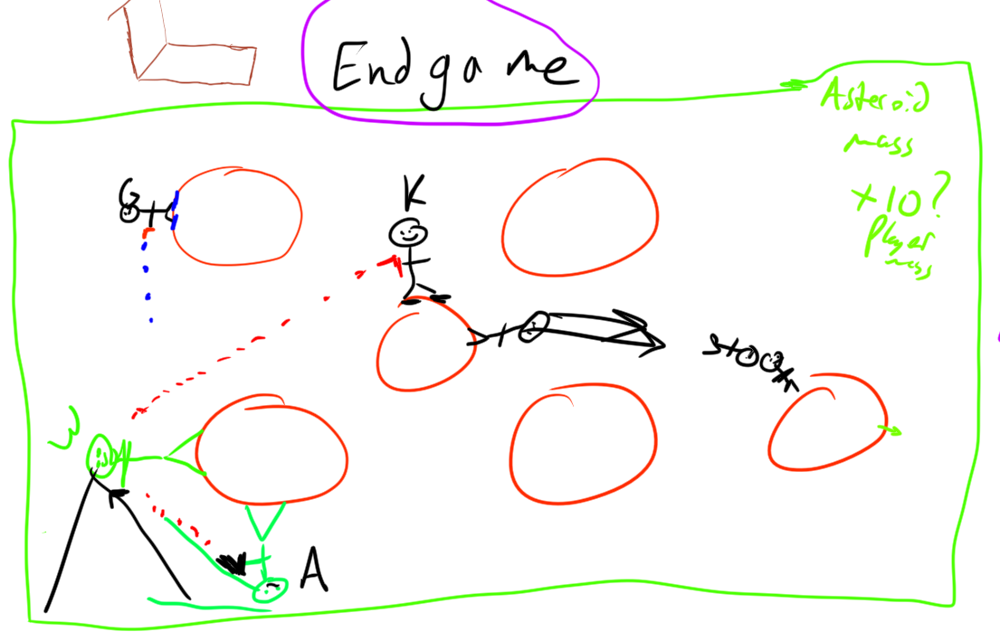

# endgameit

# Authors
Gavin, Kevin, Walter, Alek



# Tools
Three.js (a wrapper around WEBGL)
socket.io in python for backend stuff

# Game mechanics
endgameit is a team-based multiplayer game. Two teams, red and blu, each with two players face off.
The players interact in a box in a zero gravity environment subject to conservation of momentum.
There are obstacles, called asteroids (which are large relative to the sizes of the players).
Players can stick to the surfaces of the asteroids by mechanism XXX.
Players can launch themselves off of the asteroids.
Players can shoot their booleit gun (assuming them have enough booleits).
If a player is hit by a booleit, they lose a team life.
The map layout is constantly changing as asteroids move around, affected by the players.
Players are incentivized to move around by objects like booleit boxees, and extra team lives.

Players have mass 1 player mass units (pmu).
Asteroids vary in size, but not in density really, and have mass in the
interval [5pmu, 10pmu] normally distributed, with mean 7.5pmu and standard
deviation 1.2pmu.
Despite this, in a weird change of physics, the asteroids have gravity fields surrounding them.
Interestingly, the players don't exert a equal and opposite force on the asteroids.
On the other hand, there is a concept of momentum in our game. In particular,
if the player launches off of, or lands on an asteroid then momentum is
conserved (momentum = sum of mass * velocity).
Launching off of an asteroid is accomplished by a rechargeable rocket boost
thing, which is just a really quick impulse thing. Force directed in the
opposite direction to where the players head is pointing.
Recoil is a thing. If you shoot a whole bunch you can probably launch off of an
asteroid. Shooting one will not be enough though, the asteroids gravity field
will pull you back.
In terms of items laying around the map, there are extra booleit boxees, and
even (1) extra team life, potentially there will be other upgrades later as well.
In terms of booleits, their initial velocity is determined by the player.
However, they are affected by the gravity of asteroids. The booleit will travel
until hitting an asteroid or a player.
Finally, there is a sphere of "fire" enclosing the players in a confined area
(you can hide but you can't run).

## more specific information
player controls:
- space to jump
- awsd to move around on an asteroid.
- mouse input: heading, click to shoot

# "extra" features
- modify booleit velocity (would modify recoil amount too)
- damage dealing obstacles

# TODO stuff

- be able to have a "game environment" in python, with some players connected to it. socket clinets will have a game id, and each game environment object in python has stored the game stuff (asteroid locations, player locations, team lives, etc). sockets need to be able to read their game environment data. Hopefully this is on kevin's (or maybe gavin's) digital ocean server (but first locally). Note: when the clients press keys this has to be sent to the python server. Note: clients to be able to kinda extrapolate the state.
  - subtasks:
    - render the game state @WALTER && @ALEK [[draw example json]]
    - instantiate sockets @KEVIN [[can read game state and make python print something (from developer console)]]
    - update the game state on keyboard presses
    - extrapolate game state @GAVIN
    - shooting
    - putting collectible objects on the map
- team building site
  - lobby where you can view players looking for teams, you can click on a player, message them and ask to join their team, after forming a team you can challenge other formed teams


# specs
note: center of the world is (0,0,0)

```
let game_environment = {
  "redTeam": {
    "teamlives": 5
  },
  "bluTeam": {
    "teamlives": 5
  },
  "redA": { "booleits": 10, "pos": {"x": 50, "y": 50, "z": 10}, "vel": {"x": 1, "y": 2, "z": 3} },
  "redB": { "booleits": 10, "pos": {"x": 50, "y": 50, "z": 10}, "vel": {"x": 1, "y": 2, "z": 3} },
  "bluA": { "booleits": 10, "pos": {"x": 50, "y": 50, "z": 10}, "vel": {"x": 1, "y": 2, "z": 3} },
  "bluB": { "booleits": 10, "pos": {"x": 50, "y": 50, "z": 10}, "vel": {"x": 1, "y": 2, "z": 3} },
  "environment": {
    "asteroids": [
      {"pos": {"x": 1, "y": 200, "z": 3}, "vel": {"x": 1, "y": 2, "z": 3}, "mass": 4},
      {"pos": {"x": 1, "y": 300, "z": 3}, "vel": {"x": 1, "y": 2, "z": 3}, "mass": 6},
      {"pos": {"x": 1, "y": 400, "z": 3}, "vel": {"x": 1, "y": 2, "z": 3}, "mass": 7}
    ],
    "amoboxes": [
      {"pos": {"x": 1, "y": 2, "z": 100}, "vel": {"x": 1, "y": 2, "z": 3}},
    ],
    "extralife": {"pos": {"x": 1, "y": 2, "z": 200}, "vel": {"x": 1, "y": 2, "z": 3}},
    "booleits": [
      {"pos": {"x": 1, "y": 2, "z": 30}, "vel": {"x": 1, "y": 2, "z": 3}}
    ]
  }
}
```

# 1pm progress
- cube is rendered at player position
  - other stuff should be rendered too
- server can send/recieve messages

# 1pm goals for next meeting
- get everything rendered - alek + walter
- sending/recieving game state - kevin
- update speculation - gavin


